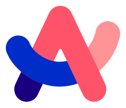

<h1 align="center">
  Elca
</h1>

  

  
  

  

## About Me

### Country

Japan :jp:

### My Site

<a href="https://portfolio.elca-web.com">here!</a>

### My Favorite

  
  
  
  
  
  

### Tools or languages I use most often

  
  
  
  
  
  
  

